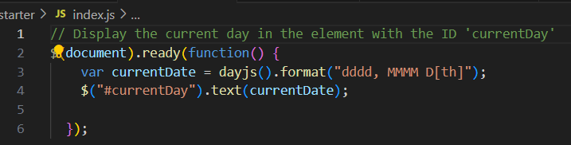

# Work Day Scheduler

Work Day Scheduler is a simple calendar app designed to help you schedule and organize your workday effectively. The application allows you to input and save tasks or events for specific hours of the day.

## Features

1. **Time Blocks:** The main page displays time blocks representing different hours of the day, providing an organized view of your work hours.

2. **Current Day Display:** The current day is prominently displayed at the top of the page, providing you with up-to-date information.

3. **Task Input:** Each time block includes a textarea where you can input and describe your tasks or events for that specific hour.

4. **Save Functionality:** The "Save" button, represented by a floppy disk icon, allows you to save the inputted task or event for the corresponding hour.

5. **Local Storage:** The application utilizes local storage to persist your tasks, ensuring that your schedule is saved even if you refresh the page or close your browser.

6. **Code Snapshot** 

## Getting Started

To use the Work Day Scheduler:

1. Open the `index.html` file in your web browser.
2. Input your tasks or events for each hour using the provided text areas.
3. Click the "Save" button next to each textarea to save the corresponding task.
4. See website URL here https://nonsoiwedinobi.github.io/Daily-Planner-App/

## Dependencies

- [jQuery](https://jquery.com/): Used for DOM manipulation and event handling.
- [dayjs](https://day.js.org/): Used for working with dates and times.

## Author

Nonso Iwedinobi

## License

This project is licensed under the [MIT License](LICENSE).
